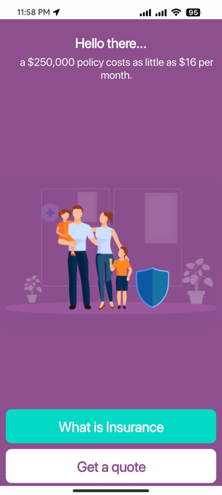
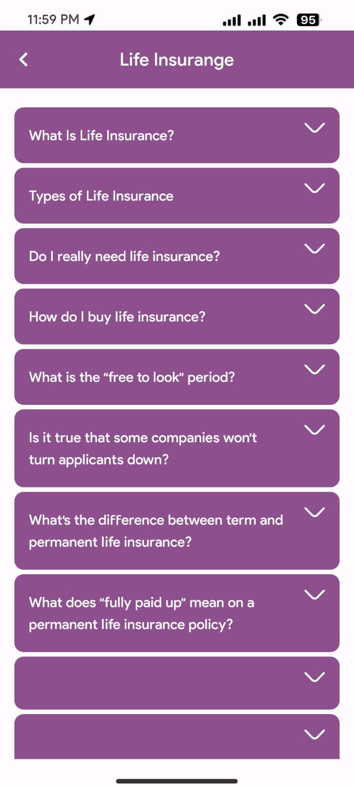
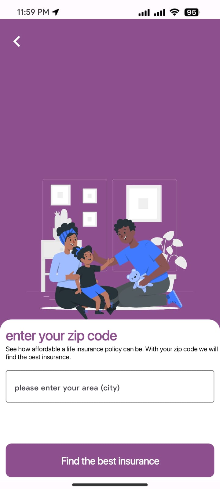
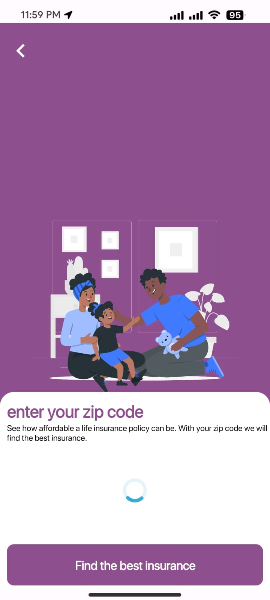
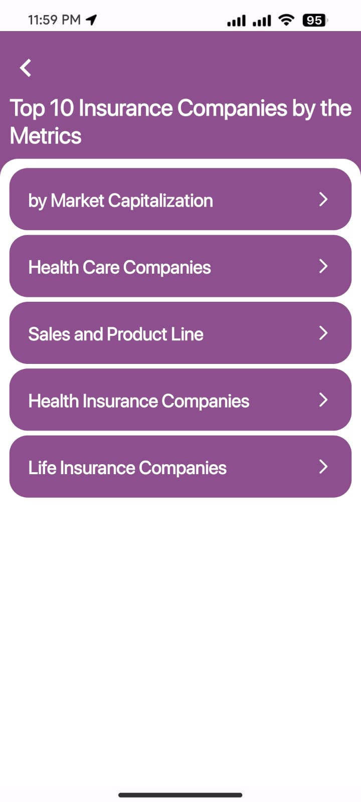
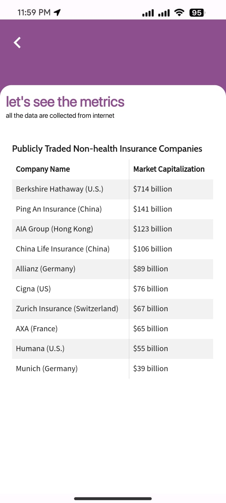

# Simple USA Insurange Trips App

  
  
   
  
   
   
  

## About the App

This is just a simple USA insurange trips app. I didn't use any api for locate the user location, this is just a simple custom insurange app where user can read the metrics or i just made this or designed this for UI also i added FAQ activity and all the faq data will get position to recyclerview

## About the Developer

Hi, I'm Sakib Al Hasan, the creator of this app. I currently live in Dhaka.

Connect with me:
- [LinkedIn]([https://linkedin.com/in/shahriarsakib-code])
- [Facebook]([https://facebook.com/shahriarsakib.bro7])

